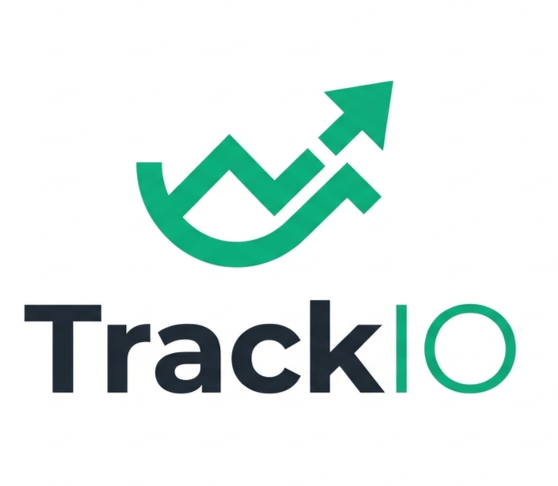
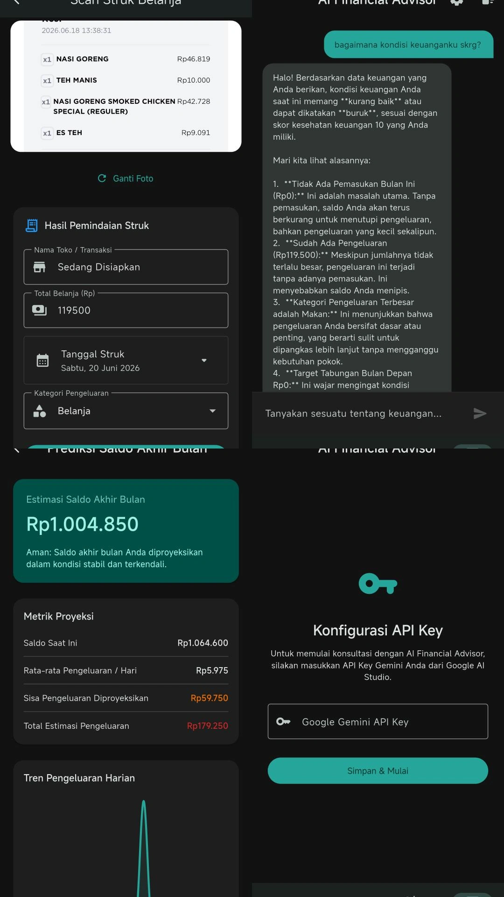

<h1 align="center">TrackIO</h1>

<p align="center">
  
</p>


<p align="center">
  <strong>Personal Finance Manager with AI Assistant</strong>
  <br />
  Track expenses, analyze spending patterns, and get AI-powered financial advice — all in one app.
</p>

<p align="center">
  
  
  
  
  
  
  
</p>

---

## Overview

TrackIO is a mobile-first personal finance management application built with Flutter. It helps users track income and expenses, visualize spending patterns, scan receipts using OCR, and receive AI-powered financial recommendations.

### Key Highlights

- **Clean Architecture** with clear separation of concerns (domain, data, presentation layers)
- **Reactive state management** using Riverpod with stream-based data flow
- **On-device OCR** receipt scanning using Google ML Kit
- **AI Financial Advisor** powered by Google Gemini 2.5 Flash
- **Offline-first** with local SQLite storage — no account or internet required for basic features

---

## Features

| Feature | Description |
|---|---|
| **Dashboard** | Real-time financial overview with balance card, charts, score, and predictions |
| **Transaction Management** | Add, edit, delete, search, and filter income/expense records |
| **AI Chat** | Conversational AI financial advisor with context-aware responses |
| **OCR Receipt Scanner** | Scan paper receipts to auto-fill transaction data |
| **Financial Score** | Health score (0-100) with breakdown by saving, expense, consistency, and stability |
| **Spending Prediction** | End-of-month balance forecast based on daily spending patterns |
| **Smart Recommendations** | Personalized insights and overspend warnings |

---

## Quick Start

### Prerequisites

- [Flutter SDK](https://flutter.dev/docs/get-started/install) (3.0+)
- Android Studio or Visual Studio Code with Flutter extensions
- An Android device or emulator (API 21+)

### Installation

```bash
# Clone the repository
git clone https://github.com/hafourenai/TrackIO.git
cd TrackIO

# Install dependencies
flutter pub get

# Build and run (debug mode)
flutter run

# Build APK
flutter build apk --debug
```

### Gemini API Key (Optional)

For AI chat features, obtain a free API key from [Google AI Studio](https://aistudio.google.com/). You can configure it inside the app under the AI Chat settings.

---

## Documentation

- [Installation Guide](docs/installation_guide.md)
- [Architecture Overview](docs/architecture.md)
- [Features](docs/features.md)
- [Project Structure](docs/project_structure.md)
- [Technology Stack](docs/technology_stack.md)
- [Troubleshooting Guide](docs/troubleshooting.md)

---

## Tech Stack

| Layer | Technology |
|---|---|
| Language | Dart 3.0+ |
| UI Framework | Flutter with Material 3 |
| State Management | Riverpod 2.x |
| Routing | GoRouter |
| Database | SQLite (sqflite) |
| Charts | fl_chart |
| AI | Google Gemini API |
| OCR | Google ML Kit Text Recognition |
| Local Storage | shared_preferences |

---

## Architecture

TrackIO follows **Clean Architecture** with three layers:

```
┌─────────────────────────────────────────┐
│           Presentation Layer            │
│  (Screens, Widgets, Providers)          │
├─────────────────────────────────────────┤
│              Domain Layer               │
│  (Entities, Repository Interfaces,      │
│   Use Cases)                            │
├─────────────────────────────────────────┤
│               Data Layer                │
│  (Database, Models, Repository Impls)   │
└─────────────────────────────────────────┘
```

- **Unidirectional data flow:** UI → Provider → Repository → Database
- **Reactive updates:** Database changes flow back through streams → providers → UI rebuilds automatically
- **Dependency inversion:** Domain layer defines interfaces; Data layer implements them

---

## Screenshots

<p align="center">
  
</p>

---

## Contact

Project Link: [https://github.com/hafourenai/TrackIO](https://github.com/hafourenai/TrackIO)

---
*Gua udah tau kok. But I Still Love U*